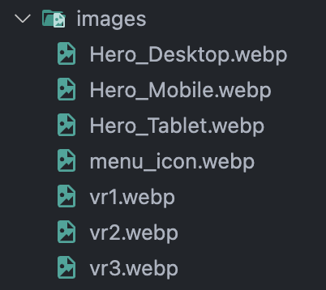

# 핵심 성능 보고서

# 바닐라 JS 프로젝트 성능 개선

- CloudFront 배포 도메인 이름: [https://dm1ip4fw2ps0h.cloudfront.net/](https://dm1ip4fw2ps0h.cloudfront.net/)

---

## 성능 개선 보고서

### **코어 웹 바이탈 측정 항목**

사용자 경험을 나타내는 핵심 지표이며 이는 웹사이트 노출 순위를 결정하는 데 중요한 역할을 합니다. 핵심 성능 보고서의 상세 지표는 아래와 같습니다.

| \*\*\*\* | **좋음🟢**     | **개선이 필요함🟠** | **나쁨🔴**     |
| -------- | -------------- | ------------------- | -------------- |
| **LCP**  | 2.5초 이하     | 4초 이하            | 4초 초과       |
| **INP**  | 200밀리초 이하 | 500밀리초 이하      | 500밀리초 초과 |
| **CLS**  | 0.1 이하       | 0.25 이하           | 0.25 초과      |

<details>
  <summary><strong>성능 개선 지표: LCP, INP, CLS</strong></summary>
  
  ### **LCP (Largest Contentful Paint)**
  - 사용자가 보는 페이지에서 **가장 큰 콘텐츠**(주로 이미지, 비디오, 텍스트 블록)가 렌더링되는 데 걸리는 시간을 측정합니다.
  - 사용자가 페이지가 로드되었다고 느끼는 시점을 나타내는 지표입니다.
  
  **LCP를 개선하는 방법**  
  1. **서버 응답 시간 단축**
     - 서버 캐싱 사용, 빠른 호스팅 서비스 활용.
  2. **이미지 최적화**
     - WebP와 같은 현대적 이미지 포맷 사용.
     - `lazy-loading` 사용으로 화면 아래 콘텐츠를 나중에 로드.
  3. **CSS와 JS 최적화**
     - 불필요한 CSS 제거, JavaScript 비동기 로드(`async` or `defer`).

### **INP (Interaction to Next Paint)**

- 사용자가 페이지에서 다양한 작업(예: 클릭, 키 입력)을 수행했을 때, 브라우저가 해당 작업을 처리하고 **화면에 변화를 표시하기까지의 평균 지연 시간**을 측정합니다.
  - FID가 최초 상호작용에만 초점을 맞췄다면, **INP는 전체 상호작용의 응답성**을 평가합니다.
- 페이지 전반에서의 **반응 속도**를 측정하며, 사용자 경험에 직접적인 영향을 미칩니다.

**INP를 개선하는 방법**

1. **JavaScript 실행 시간 단축**
   - 불필요한 스크립트 제거 및 `code splitting` 활용.
2. **메인 스레드 작업 최적화**
   - 작업을 Web Worker로 이동해 메인 스레드 부담을 줄임.
3. **Third-party Script 최소화**
   - 타사 스크립트를 비동기 처리 또는 필요한 것만 사용.

### **CLS (Cumulative Layout Shift)**

- 페이지가 로드되면서 **요소들이 예상치 못하게 움직이는 정도**를 측정합니다.
  - 예: 로딩 중에 이미지가 나타나면서 텍스트가 아래로 밀리는 경우.
- 시각적 안정성을 평가하는 지표로, **사용자 혼란과 실수를 줄이는 데 중요**합니다.

**CLS를 개선하는 방법**

1. **이미지 크기 지정**
   - `` 태그에 `width`와 `height` 속성 명시.
2. **동적 콘텐츠 안정화**
   - 광고 및 임베디드 콘텐츠 영역에 고정 크기를 정의.
3. **폰트 최적화**
   - 웹 폰트 로드 시 기본 폰트(`fallback font`)와 크기를 유사하게 설정해 점프 현상 방지.

[참고 자료: Google Support](https://support.google.com/webmasters/answer/9205520?hl=ko)  
 [참고 자료: Web.dev](https://web.dev/articles/vitals?hl=ko)

</details>

---

# 개선 이유

### 개선 전

- LCP (Largest Contentful Paint) 개선 필요
- CLS(Cumulative Layout Shift) 개선 필요

| 항목                         | LCP | CLS |
| ---------------------------- | --- | --- |
| 이미지 최적화 필요           | ✅  |     |
| lazy loading 적용 필요       | ✅  |     |
| 폰트 및 CSS 최적화 필요      |     | ✅  |
| 렌더링 차단 리소스 제거 필요 | ✅  | ✅  |


---

# 개선 방법

### **이미지 인코딩 최적화 (Efficiently encode images**)

- WebP와 같은 최신 이미지 포맷을 사용하여 **이미지 포맷 최적화**

  <details>
  <summary><strong>WebP</strong></summary>

  

  **파일변환 → WebP**

  `webp` 설치:

  ```bash
  brew install webp
  ```

  변환 명령어:

  ```bash
  cd /path/to/images

  # 폴더 내 모든 이미지 파일을 .webp로 변환하는 명령어
  # 아래 명령어는 *.jpg, *.jpeg, *.png 파일을 WebP로 변환하는 예시입니다.
  for img in *.jpg *.png; do
      cwebp "$img" -o "${img%.*}.webp"
  done
  ```

    </details>

### **렌더링 차단 리소스 제거 (Eliminate render-blocking resources**)

- **비동기적 로딩**: JavaScript 파일을 비동기적으로 로딩하여 페이지 렌더링이 차단되지 않도록 합니다. `async` 또는 `defer` 속성을 사용하여 스크립트 파일을 비동기적으로 로드할 수 있습니다.

```bash
<script type="text/javascript" src="/js/main.js" defer></script>
<script type="text/javascript" src="/js/products.js" defer></script>
```

<details>
  <summary>
    <strong>async와 defer의 차이 </strong>
  </summary>

| 특성                        | `async`                                                  | `defer`                                                         |
| --------------------------- | -------------------------------------------------------- | --------------------------------------------------------------- |
| **스크립트 실행 시점**      | 스크립트가 로드된 즉시 실행 (HTML 문서 파싱 중)          | HTML 문서 파싱 후 실행                                          |
| **실행 순서**               | 로드된 순서대로 실행 (순서 보장 없음)                    | 문서에 작성된 순서대로 실행 (순서 보장)                         |
| **페이지 렌더링 차단 여부** | 페이지 렌더링을 차단하고 실행 (빠르게 로드하지만 블로킹) | 페이지 렌더링을 차단하지 않고 실행                              |
| **주로 사용되는 경우**      | 독립적이고 순서에 의존하지 않는 스크립트                 | DOM 조작이 필요한 스크립트 (예: `DOMContentLoaded` 이벤트 관련) |

</details>

### **이미지에 명시적인 크기 설정 (Image elements do not have explicit width and height )**

- **너비와 높이 지정**: 이미지 요소에 `width`와 `height` 속성을 명시적으로 지정하여 이미지의 크기가 변경되지 않도록 하고, 페이지 로딩 성능을 향상시킬 수 있습니다.

```html


or img { width: 100%; height: auto; }
```

### **페이지 로딩 성능 최적화 (lazy loading)**

- **스크롤할 때 로딩되는 이미지**: 페이지를 처음 열 때 모든 이미지를 로드하는 것이 아니라, 사용자가 해당 이미지가 포함된 부분까지 스크롤할 때 이미지를 로드하도록 할 때 사용합니다.
- **리소스를 미리 로드할 필요가 없는 이미지**: 화면에 바로 보이지 않는 이미지들, 즉 페이지 내에서 아래쪽에 위치하거나 스크롤을 내려야 보이는 이미지들에 적합합니다.

```html
loading="lazy"


```

### Eliminate render-blocking resources

**Google Fonts**에서 폰트를 로드하는 `<link>` 태그는 **첫 번째 페인트**(first paint)에 영향을 줄 수 있습니다.


- ~~폰트 파일을 로컬 서버에 호스팅~~  
  assets > fonts > .woff 파일로 변환.  
  폰트 요청 최적화 (Preload): rel="preload"

```html
기존 <link rel="preload" href="https://fonts.googleapis.com/css?family=Heebo:300,400,600,700&display=swap" as="style" />
```

```css
@font-face {
  font-family: Heebo;
  font-weight: 300;
  font-style: normal;
  font-display: swap;
  src: url("/assets/fonts/Heebo-Bold.woff2") format("woff2"), url("/assets/fonts/Heebo-Light.woff") format("woff");
}
```

---

# 개선 후 향상된 지표

### 다음은 성능 개선 전후를 비교한 표입니다.

### **🎯 Lighthouse 점수**

| **카테고리**       | **개선 전 점수** | **개선 전 상태** | **개선 후 점수** | **개선 후 상태** | **차이점**                    |
| ------------------ | ---------------- | ---------------- | ---------------- | ---------------- | ----------------------------- |
| **Performance**    | 72%              | 🟠               | 92%              | 🟢               | **+20%** (성능이 크게 개선됨) |
| **Accessibility**  | 82%              | 🟠               | 89%              | 🟠               | **+7%** (소폭 개선됨)         |
| **Best Practices** | 75%              | 🟠               | 71%              | 🟠               | **-4%** (소폭 하락)           |
| **SEO**            | 82%              | 🟠               | 82%              | 🟠               | **변동 없음**                 |
| **PWA**            | 0%               | 🔴               | 0%               | 🔴               | **변동 없음**                 |

### **📊 Core Web Vitals (2024)**

| **지표**    | **개선 전** | **개선 후** | **변경량** | **개선 비율**  |
| ----------- | ----------- | ----------- | ---------- | -------------- |
| **LCP (s)** | 14.63s      | 3.31s       | -11.32s    | 약 77.3% 개선  |
| **CLS**     | 0.016       | 0.009       | -0.007     | 약 43.75% 개선 |

### 개선 후

https://pagespeed.web.dev/analysis/https-dm1ip4fw2ps0h-cloudfront-net-index-html/lzekkwslsz?form_factor=desktop


---

# 기타 등등

[🤮 삽질의 시간](https://invincible-account-148.notion.site/1499deebdc0c8022af69d64f8ee997f0?pvs=73)

- 추후 참고할 내용들  
  https://web.dev/articles/lcp?hl=ko#measure_lcp_in_javascript
  https://web.dev/articles/inp?hl=ko#how-to-measure-inp
  https://web.dev/articles/cls?hl=ko#measure_cls_in_javascript
  https://web.dev/articles/optimize-lcp?hl=ko
  https://web.dev/articles/optimize-inp?hl=ko
  https://web.dev/articles/optimize-cls?hl=ko
